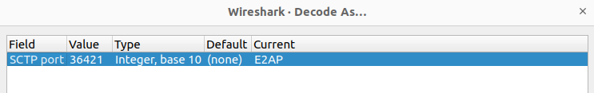
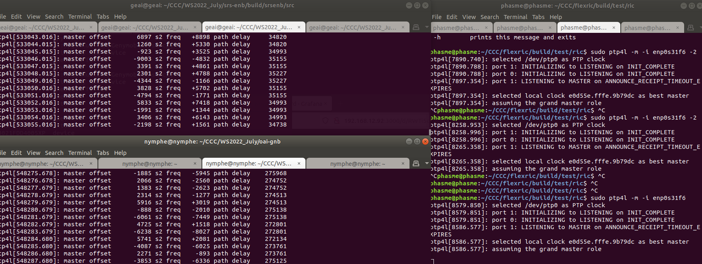

# FlexRIC introduction

This repository contains [O-RAN Alliance](https://www.o-ran.org/) compliant E2 Node Agent emulators, a nearRT-RIC, and xApps written in C/C++ and Python.
It implements various service models (O-RAN standard E2SM-KPM v2.01/v2.03/v3.00 and E2SM-RC v1.03, as well as customized NG/GTP, PDCP, RLC, MAC, SC and TC). 
Depending on the service model, different encoding schemes have been developed (ASN.1, flatbuffer, plain). 
The indication data received in the xApp uses as persistence mechanism an sqlite3 database for enabling offline processing applications (e.g., ML/AI). 
Moreover it supports E2AP v1.01/v2.03/v3.01 for all the SMs.

If you want to know more about FlexRIC and its original architecture, you can find more details at: Robert Schmidt, Mikel Irazabal, and Navid Nikaein. 2021.
FlexRIC: an SDK for next-generation SD-RANs. In Proceedings of the 17th International Conference on emerging Networking EXperiments and Technologies (CoNEXT
'21). Association for Computing Machinery, New York, NY, USA, 411–425. DOI: https://doi.org/10.1145/3485983.3494870. A pdf copy is available at
https://bit.ly/3uOXuCV 

Below is the list of features available in this version divided per component and per service model:

|           | OAI-5g | SRS-5g | E2 agent emulators | nearRT-RIC | xApp C/C++ SDK | xApp Python SDK | O-RAN standardized |
|:----------|:-------|:-------|:-------------------|:-----------|:---------------|:----------------|:-------------------|
| E2SM-KPM  | Y      | Y      | Y                  | Y          | Y              | N               | Y                  |
| E2SM-RC   | Y      | Y      | Y                  | Y          | Y              | N               | Y                  |
| MAC       | Y      | N      | Y                  | Y          | Y              | Y               | N                  |
| RLC       | Y      | N      | Y                  | Y          | Y              | Y               | N                  |
| PDCP      | Y      | N      | Y                  | Y          | Y              | Y               | N                  |
| GTP       | Y      | N      | Y                  | Y          | Y              | Y               | N                  |
| SLICE     | N      | N      | Y                  | Y          | Y              | Y               | N                  |
| TC        | N      | N      | Y                  | Y          | Y              | N               | N                  |

[[_TOC_]]

# 1. Installation

## 1.1 Prerequisites

### 1.1.1 GCC compiler
- Please make sure you have gcc-13 installed (gcc-10 and 12 are compatible as well). Follow the next steps:
```bash
sudo apt update -y
sudo apt upgrade -y
sudo apt install -y build-essential
sudo apt install -y gcc-13 g++-13 cpp-13
sudo update-alternatives --install /usr/bin/gcc gcc /usr/bin/gcc-13 100 --slave /usr/bin/g++ g++ /usr/bin/g++-13 --slave /usr/bin/gcov gcov /usr/bin/gcov-13
sudo update-alternatives --config gcc # chose gcc-13
```
Note: gcc-11 is not supported in FlexRIC

### 1.1.2 (opt.) Wireshark
Per `O-RAN.WG3.E2GAP-v02.00` specifications, no SCTP port is specified for E2AP protocol. In our implementation, we use port number 36421. Please, add the following configuration in Wireshark:



### 1.1.3 (opt.) Flatbuffer encoding
We also provide a flatbuffers encoding/decoding scheme as alternative to ASN.1. In case that you want to use it  follow the
instructions at https://github.com/dvidelabs/flatcc and provide the path for the lib and include when selecting it at `ccmake ..` from the build directory

## 1.2 Download the required dependencies

### 1.2.1 Mandatory dependencies
```bash
sudo apt install libsctp-dev cmake-curses-gui libpcre2-dev
```

### 1.2.2 (opt.) Multi-language xApp requirements
- SWIG (at least  v.4.1).
We use SWIG as an interface generator to enable the multi-language feature (i.e., C/C++ and Python) for the xApps. Please, check your SWIG version (i.e, `swig-version`) and install it from scratch if necessary as described here: https://swig.org/svn.html or via the code below:
```bash
git clone https://github.com/swig/swig.git
cd swig
git checkout release-4.1 
./autogen.sh
./configure --prefix=/usr/
make -j8
sudo make install
```

- Python dependency
```bash
sudo apt-get install python3.10-dev
```

# 2. FlexRIC installation

## 2.1 Clone the FlexRIC repository
```bash
git clone https://gitlab.eurecom.fr/mosaic5g/flexric
cd flexric/
```

## 2.2 Build FlexRIC
```bash
mkdir build && cd build && cmake .. && make -j8
```
If you have installed optional libraries from section [1.2.2 (opt.) Multi-language xApp requirements](#122-opt-multi-language-xapp-requirements), run the following command:
```bash
mkdir build && cd build && cmake -DXAPP_MULTILANGUAGE=ON .. && make -j8
```

Currently available versions:
|            |E2SM-KPM v2.01|E2SM-KPM v2.03|E2SM-KPM v3.00|
|:-----------|:-------------|:-------------|:-------------|
| E2AP v1.01 | Y            | Y            | Y            |
| E2AP v2.03 | Y            | Y (default)  | Y            |
| E2AP v3.01 | Y            | Y            | Y            |

If you wish to modify the default versions, please, execute this command:
```bash
mkdir build && cd build && cmake -DE2AP_VERSION=E2AP_VX -DKPM_VERSION=KPM_VY .. && make -j8
```
where `X`=`1`,`2`,`3`, and `Y`=`2_01`,`2_03`,`3_00`.

If you want to profile FlexRIC, or just need a fast nearRT-RIC, you should build FlexRIC in release mode to enable compiler optimizations:
```bash
mkdir build && cd build && cmake -DCMAKE_BUILD_TYPE=Release .. && make -j8
```

## 2.3 Installation of Service Models (SMs)
The service models are shared by xApps and the RAN. Therefore, they have to be installed in a place where the RAN can access them. The easiest is to install them globally, by typing:
```bash
sudo make install
```

By default installation path is `/usr/local/`. Therefore service model libraries in `/usr/local/lib/flexric` while the configuration file in `/usr/local/etc/flexric`.
If you would like to change the default installation path, please compile as following:
```bash
mkdir build && cd build && cmake -DCMAKE_INSTALL_PREFIX=<new-path> .. && make -j8
```

* Note: Command `sudo make install` installs shared libraries that represent Service Models. Each time E2AP and/or E2SM-KPM versions are modified, the command must be executed again.

Check that everything went fine by running unit tests:
```bash
ctest -j8 --output-on-failure
```

# 3. Service Models

## 3.1 O-RAN
For a deeper understanding, we recommend that users of FlexRIC familiarize themselves with O-RAN WG3 specifications available at the [O-RAN specifications page](https://orandownloadsweb.azurewebsites.net/specifications).

The following specifications are recommended:
- `O-RAN.WG3.E2GAP-v02.00` - nearRT-RIC architecture & E2 General Aspects and Principles: important for a general understanding for E2
- `O-RAN.WG3.E2AP-version` - E2AP protocol description
- `O-RAN.WG3.E2SM-KPM-version` - E2SM-KPM Service Model description
- `O-RAN.WG3.E2SM-RC-v01.03` - E2SM-RC Service Model description

### 3.1.1 E2SM-KPM
As mentioned in section [2.2 Build FlexRIC](#22-build-flexric), we support E2SM-KPM v2.01/v2.03/v3.00 which all use ASN.1 encoding.

### 3.1.2 E2SM-RC
We support E2SM-RC v1.03 which uses ASN.1 encoding.

## 3.2 Custom Service Models
In addition, we support custom service models, such are MAC, RLC, PDCP, GTP, SLICE and TC (traffic control). All use plain encoding, i.e., no ASN.1, but write the binary data into network messages.
However, please be aware that not all of them are supported with OAI RAN, and written in C/Python languages. For more information, please refer to the table in [FlexRIC introduction](#flexric-introduction).

# 4. Deployment

## 4.1 Bare-metal testbed
Optionally run Wireshark and capture E2AP traffic.

* Start the nearRT-RIC
Please make sure to set the desired nearRT-RIC IP address `NEAR_RIC_IP` in `/usr/local/etc/flexric/flexric.conf`.
```bash
./build/examples/ric/nearRT-RIC
```

In addition, if FlexRIC is installed in the custom `<new-path>` path, please specify the configuration file and service model paths as follows:
```bash
./build/examples/ric/nearRT-RIC -c <new-path>/etc/flexric/flexric.conf -p <new-path>/lib/flexric/
```
Same applies to E2 agent emulators.

* Start E2 agent emulators
  * gNB-mono
  ```bash
  ./build/examples/emulator/agent/emu_agent_gnb
  ```
  * if CU/DU split is used, start the gNB as follows
  ```bash
  ./build/examples/emulator/agent/emu_agent_gnb_cu
  ./build/examples/emulator/agent/emu_agent_gnb_du
  ```
  * eNB
  ```bash
  ./build/examples/emulator/agent/emu_agent_enb
  ```

Check that you see the E2 Setup Request and Response messages in Wireshark. 
Within E2 Setup Request message, E2 node sends the list of supported service models (its "capabilities"), such are E2SM-KPM and E2SM-RC supported RAN Functions.

As this section is dedicated for testing with E2 agent emulators, **all RIC INDICATION messages contain random data, as there is no UE connected**.

`XAPP_DURATION` environment variable overwrites the default xApp duration of 20s. If the negative value used, the xApp duration is considered to be infinite.
* Start different C xApps
  * start the E2SM-KPM monitor xApp - fetch UE-level measurements based on S-NSSAI `(1, 0xffffff)` condition; `O-RAN.WG3.E2SM-KPM-version` section 7.4.5 - REPORT Service Style 4 ("Common condition-based, UE-level")
  ```bash
  XAPP_DURATION=20 ./build/examples/xApp/c/monitor/xapp_kpm_moni # not supported by emu_agent_enb
  ```

  * start the E2SM-RC monitor xApp - based on `ORAN.WG3.E2SM-RC-v01.03` specification, aperiodic subscriptions to:
    * REPORT Service Style 1 ("Message Copy") - section 7.4.2
      * `RRC Message` (`RRC Reconfiguration`, `Measurement Report`, `Security Mode Complete`, `RRC Setup Complete`)
      * `UE ID` (when `RRC Setup Complete` and/or `F1 UE Context Setup Request` detected)
    * REPORT Service Style 4 ("UE Information") - section 7.4.5
      * `UE RRC State Change` (`RRC connected`, `RRC inactive`, `RRC idle`)
  ```bash
  XAPP_DURATION=20 ./build/examples/xApp/c/monitor/xapp_rc_moni # not supported by eNB as per spec
  ```

  * start the E2SM-RC control xApp - RAN control function "QoS flow mapping configuration" (e.g. creating a new DRB); `ORAN.WG3.E2SM-RC-v01.03` section 7.6.2 - CONTROL Service Style 1 ("Radio Bearer Control")
  ```bash
  XAPP_DURATION=20 ./build/examples/xApp/c/kpm_rc/xapp_kpm_rc # not supported by emu_agent_enb
  ```

  * start the (MAC + RLC + PDCP + GTP) monitor xApp
  ```bash
  XAPP_DURATION=20 ./build/examples/xApp/c/monitor/xapp_gtp_mac_rlc_pdcp_moni
  ```

  * start the MAC control xApp
  ```bash
  ./build/examples/xApp/c/ctrl/xapp_mac_ctrl # not supported by emu_agent_enb and emu_agent_gnb_cu
  ```

  * start the slicing xApp
  ```bash
  ./build/examples/xApp/c/slice/xapp_slice_moni_ctrl
  ```

  * start the TC xApps
  ```bash
  ./build/examples/xApp/c/tc/xapp_tc_all
  ./build/examples/xApp/c/tc/xapp_tc_codel
  ./build/examples/xApp/c/tc/xapp_tc_ecn
  ./build/examples/xApp/c/tc/xapp_tc_osi_codel
  ./build/examples/xApp/c/tc/xapp_tc_partition 36422 # second argument must be the xApp port
  ```

  * if `XAPP_MULTILANGUAGE` option is enabled, start the python xApps:
  ```bash
  # (MAC + RLC + PDCP + GTP) monitor xApp
  XAPP_DURATION=20 python3 build/examples/xApp/python3/xapp_mac_rlc_pdcp_gtp_moni.py
  # slicing xApp
  python3 build/examples/xApp/python3/xapp_slice_moni_ctrl.py
  cd build/examples/xApp/python3 && ./watch_slice_stats # to observe real-time stats for network slices
  ```

Multiple xApps can be run in parallel.

At this point, FlexRIC is working correctly in your computer and you have already tested the multi-agent, multi-xApp and multi-language capabilities. 

The latency that you observe in your monitor xApp is the latency from the E2 Agent to the nearRT-RIC and xApp. In modern computers the latency should be less than 200 microseconds or 50x faster than the O-RAN specified minimum nearRT-RIC latency i.e., (10 ms - 1 sec) range.
Therefore, FlexRIC is well suited for use cases with ultra low-latency requirements.
Additionally, all the data received in the xApp is also written to `/tmp/xapp_db` in case that offline data processing is wanted (e.g., Machine Learning/Artificial Intelligence applications). You browse the data using e.g., sqlitebrowser. 
Please, check the example folder for other working xApp use cases.

## 4.2 (opt.) Docker testbed
FlexRIC is supported on the following distributions: Ubuntu, Red Hat, and Rocky Linux. You can build the images as:
```bash
# Ubuntu
docker buildx build --no-cache --target oai-flexric --tag oai-flexric:dev --file docker/Dockerfile.flexric.ubuntu .
# Red Hat
docker buildx build --no-cache --target oai-flexric --tag oai-flexric:dev --file docker/Dockerfile.flexric.rhel .
# Rocky Linux
docker buildx build --no-cache --target oai-flexric --tag oai-flexric:dev --file docker/Dockerfile.flexric.rocky .
```

In order to reproduce the [bare-metal testbed](#41-bare-metal-testbed) in docker environment, follow the next steps:
```bash
cd docker
docker compose up -d
```

# 5. Integration with RAN and example of deployment

## 5.1 Integration with OpenAirInterface 5G RAN
Follow the instructions https://gitlab.eurecom.fr/oai/openairinterface5g/-/blob/develop/openair2/E2AP/README.md.

## 5.2 Integration with srsRAN 5G RAN
Follow the instructions https://docs.srsran.com/projects/project/en/latest/tutorials/source/near-rt-ric/source/index.html.

## 5.3 Integration with Keysight RICtest

The OAI nearRT-RIC with the xApp `flexric/examples/xApp/c/keysight/xapp_keysight_kpm_rc.c` were successfully tested with [Keysight's RICtest RAN emulator](https://www.keysight.com/us/en/product/P8828S/rictest-ran-intelligent-controller-test-solutions.html), as demonstrated at O-RAN PlugFest Fall 2023.

Please find more information at the following links (available only to the O-RAN Alliance members):
* [recorded PlugFest session](https://oranalliance.atlassian.net/wiki/download/attachments/2907668584/O-RAN_PFFall2023_venue05.mp4). FlexRIC is shown after 3 hours 33 minutes (3:33:00).
* [accompanying presentation](https://oranalliance.atlassian.net/wiki/download/attachments/2907668584/O-RAN_PFFall2023_venue05.pdf); the mentioned xApp is shown starting at slide 190.

## 5.4  Integration with ns-O-RAN simulator
Developed by WIoT at Northeastern University, [ns-O-RAN](https://openrangym.com/ran-frameworks/ns-o-ran) is the first open source simulation platform that combines [a functional 4G/5G protocol stack in ns-3](https://github.com/nyuwireless-unipd/ns3-mmwave) with an [O-RAN-compliant E2 interface](https://gerrit.o-ran-sc.org/r/admin/repos/sim/ns3-o-ran-e2,general).

Recognizing the critical role of the ns-O-RAN simulator, the Orange Innovation Egypt team successfully integrated the OAI nearRT-RIC with this simulator, resulting in the creation of a new xApp testing framework named [ns-O-RAN-flexric](https://github.com/Orange-OpenSource/ns-O-RAN-flexric/). A summary of the enhancements made to each repository is illustrated in the diagram below:


The simulator has been updated and enhanced to support E2AP v1.01, E2SM-KPM v3.00, and E2SM-RC v1.03. This framework has been tested with the `/build/examples/xApp/c/kpm_rc/xapp_kpm_rc` xApp with different scenarios.

## 5.5 (opt.) Synchronize clock
Before running the various components (RAN/nearRT-RIC/xApps), you probably want to align the machines' clock. For this aim, you can use `ptp4l` in all the machines
involved (if you have for example deployed the various components on different hosts)

```bash
sudo ptp4l -m -i InterfaceName #for master
sudo ptp4l -m -i InterfaceName -s #for slaves
```


Following make sure that no ntpd, chrondy or timesyncd is running in the system (e.g., `sudo systemctl stop systemd-timesyncd`). 

```bash
sudo phc2sys -m -s InterfaceName -w
```



# 6. Integration with other nearRT-RICs 

## 6.1 O-RAN OSC nearRT-RIC
FlexRIC's E2 Agent (and OAI RAN that is embedded on it) has also been successfully tested using O-RAN's OSC nearRT-RIC H Release as shown at https://openairinterface.org/news/openairinterface-will-showcase-3-demos-at-the-o-ran-f2f-meeting-in-phoenix/ and https://openairinterface.org/joint-osc-oai-workshop-end-to-end-open-source-reference-designs-for-o-ran/ 

Follow OSC nearRT-RIC installation guide. The xApp can be found at https://github.com/mirazabal/kpm_rc-xapp. Please, note that we do not give support for the OSC nearRT-RIC.  

Recorded presentation at Phoenix, October 2023 (4th minute): https://zoom.us/rec/play/N5mnAQUcEVRf8HN6qLYa4k7kjNq3bK4hQiYqHGv9KUoLfcR6GHiE-GvnmAudT6xccmZSbkxxYHRwTaxk.Zi7d8Sl1kQ6Sk1SH?canPlayFromShare=true&from=share_recording_detail&continueMode=true&componentName=rec-play&originRequestUrl=https%3A%2F%2Fzoom.us%2Frec%2Fshare%2FwiYXulPlAqIIDY_vLPQSGqYIj-e5Ef_UCxveMjrDNGgXLLvEcDF4v1cmVBe8imb4.WPi-DA_dfPDBQ0FH

# 7. Support/further resources
* Mailing list: if you need help or have some questions, you can subscribe to the mailing list `techs@mosaic-5g.io` that you can find at
  https://gitlab.eurecom.fr/mosaic5g/mosaic5g/-/wikis/mailing-lists. The emails are archived and available publicly. 
* [Demo](DEMO.md) for flexric in July 2022
* [The Wiki space](https://gitlab.eurecom.fr/mosaic5g/flexric/-/wikis/home) contains tutorials and presentations
* [Original FlexRIC paper ACM CoNEXT 2021](https://bit.ly/3uOXuCV)

# 8. OAM Project Group & Roadmap
Check https://openairinterface.org/projects/oam-project-group/

# 9. FlexRIC Milestone
Check on https://gitlab.eurecom.fr/mosaic5g/flexric/-/milestones and in https://openairinterface.org/mosaic5g/
